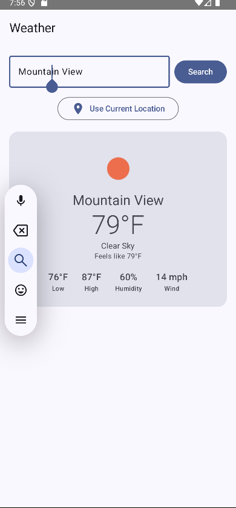
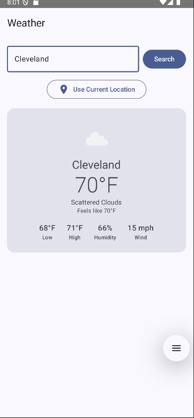
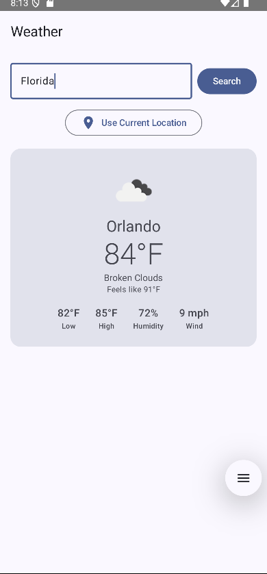
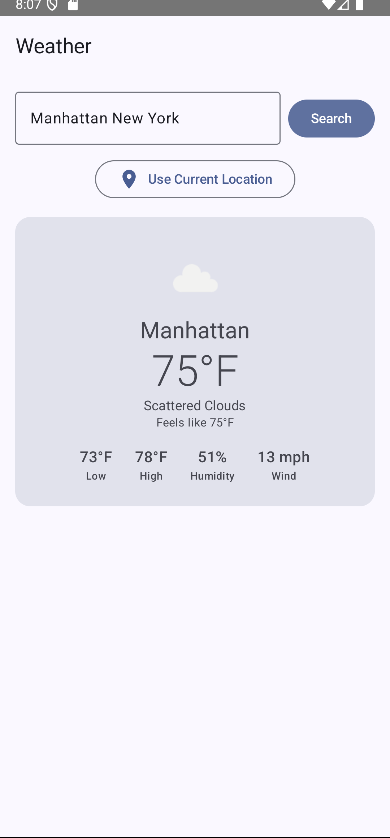
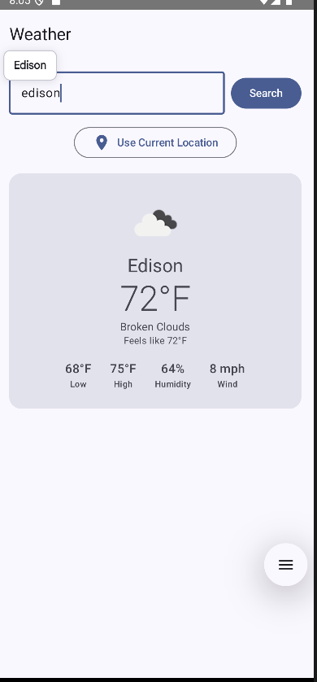
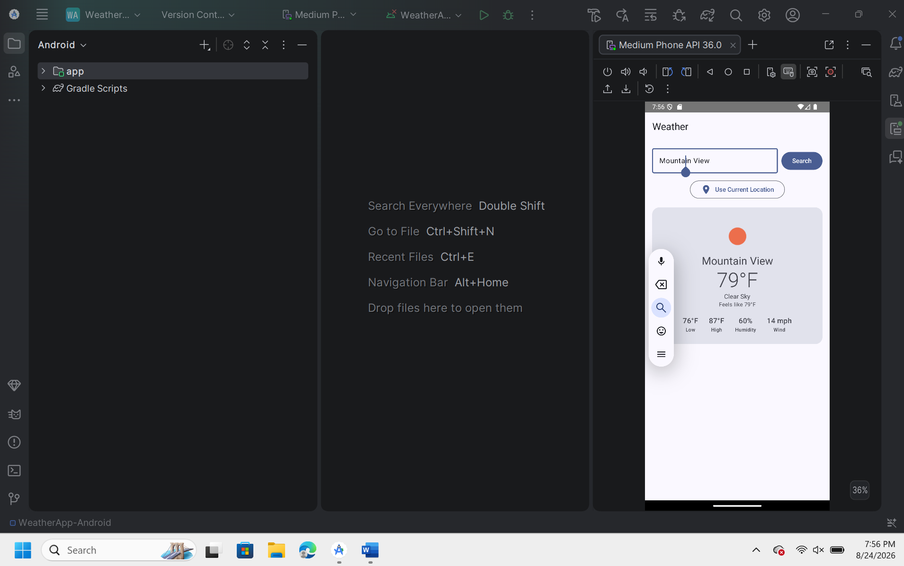
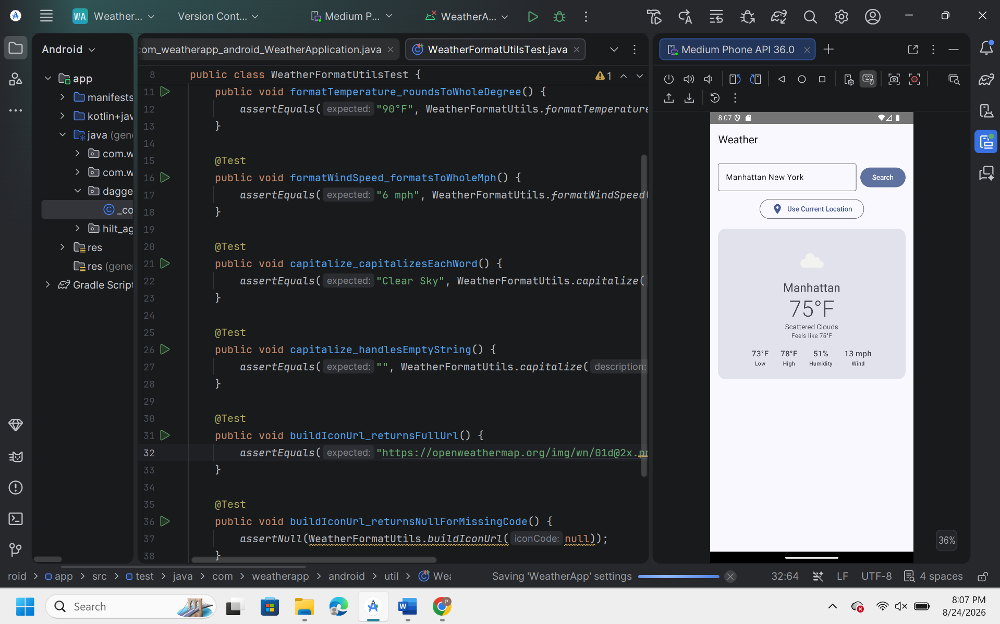

# Weather

A native Android weather app: search any US city or use your current
location, see live conditions with a matching icon, and pick up right where
you left off on next launch. Built as a coding-challenge submission, but
architected the way I'd want a small production feature to look — clean
layers, dependency injection, and a real test suite.

<p align="center">
  
  
  
</p>

## What it does

- Search any US city and get current temperature, conditions, high/low,
  humidity, and wind — with a live weather icon from OpenWeatherMap.
- Or tap **Use Current Location** to fetch weather for wherever you are,
  after a proper runtime permission request.
- Remembers the last city you searched and reloads it automatically next
  time you open the app — no need to search again.
- Fails gracefully: no API key, no signal, an unrecognized city, a denied
  permission — every case shows a plain-English message instead of a crash
  or a raw error code.

## Screenshots

| Current location | Search result | Search result |
|---|---|---|
|  |  |  |

| Search result | Search result | Search result |
|---|---|---|
|  |  |  |

## Built and run in Android Studio

Developed, built, and tested directly in Android Studio — running on the
Medium Phone API 36 emulator, with the project's Version Control and Gradle
tooling visible in the IDE itself:

<p align="center">
  
</p>

<p align="center">
  
</p>

More full-IDE captures (one per search result above) are in
[`screenshots/studio/`](screenshots/studio/).

## Tech stack

| | |
|---|---|
| **Language** | Kotlin + Java, with real interop between them (not just separate files) |
| **Architecture** | MVVM, with a stateful/stateless composable split |
| **UI** | Jetpack Compose (Material 3) + Jetpack Navigation |
| **DI** | Hilt |
| **Networking** | Retrofit + OkHttp + Gson |
| **Concurrency** | Kotlin Coroutines / `StateFlow` |
| **Testing** | JUnit + Mockito, hand-written fakes for every service interface |

## Why this codebase, not just "it works"

- **Every service is an interface** (`WeatherRepository`, `LocationProvider`,
  `PersistenceRepository`, `WeatherIconCache`), bound via Hilt. The
  `ViewModel` depends on interfaces, never concrete implementations — so
  tests swap in hand-written fakes with no mocking framework and no real
  network, location, or storage involved.
- **The `ViewModel` never touches Android permission APIs.** Only an
  `Activity`/composable can show the system permission dialog on Android, so
  that responsibility stays in the UI layer; the `ViewModel` just receives a
  plain `Boolean` and decides what to do with it. That boundary is what
  keeps the permission *decision logic* fully unit-testable.
- **Every failure path is normalized** into one sealed `WeatherError` type
  with a message meant for a person to read — the UI layer never sees a raw
  `IOException` or HTTP status code.
- **A stateful/stateless split in the UI layer**: `WeatherRoute` wires up
  Hilt and Android permissions; `WeatherScreen` is a pure function of its
  parameters. That keeps almost all the real logic sitting in one tested
  place (the `ViewModel`) instead of spread across composables.
- **The Java files are real interop, not just separate files**: Kotlin code
  calls straight into `CurrentWeatherResponse.java` and `WeatherFormatUtils.java`
  with no wrapper — `response.main.temp` reads a Java getter as a Kotlin
  property, and `WeatherFormatUtils.formatTemperature(...)` is called like an
  ordinary Kotlin function.

## Running it

1. **Android Studio** (Hedgehog/2023.1+), with an SDK for API 34 installed.
2. Get a free API key at [openweathermap.org](https://openweathermap.org/)
   → **API keys**. (Can take up to a couple of hours to activate.)
3. Open this folder in Android Studio and let it sync.
4. Copy `local.properties.example` → `local.properties`, and add:
   ```
   OWM_API_KEY=your_key_here
   ```
5. Run ▶ on an emulator or device (API 26+).

Run the test suite: `.\gradlew.bat testDebugUnitTest` (macOS/Linux:
`./gradlew testDebugUnitTest`).

## Project layout

```
app/src/main/java/com/weatherapp/android/
  ui/weather/       WeatherViewModel, WeatherScreen (Compose), WeatherRoute
  data/             Retrofit service + repositories + location + icon cache
  di/               Hilt modules
  domain/           WeatherError and small value types
  util/              WeatherFormatUtils.java

app/src/test/java/com/weatherapp/android/
  fakes/            Hand-written test doubles for every service interface
  ...               ViewModel, repository, and mapper tests
```
